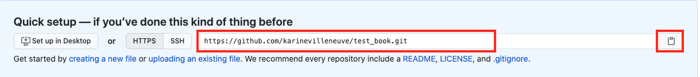
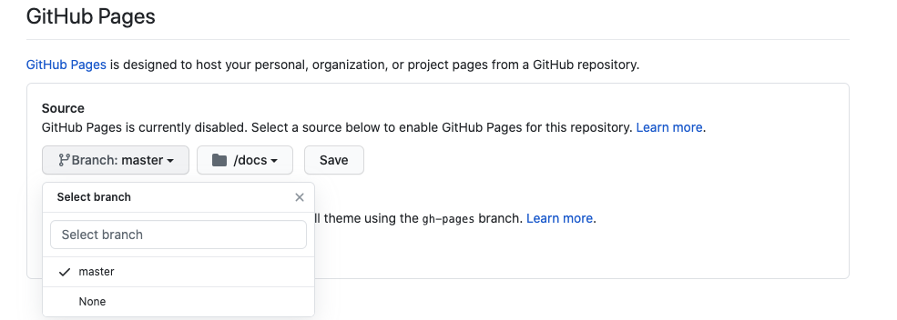

# Host Bookdown on Github

Before anything, I highly suggest going through [Bookdown: Authoring Books and Technical Documents with R Markdown](https://bookdown.org/yihui/bookdown/) in order to understand the basics to setting up your own bookdown.

## Getting Bookdown started 

1. From the [Get started](https://bookdown.org/yihui/bookdown/get-started.html) page download the Zip file, then unzip it locally.
2. Install the RStudio IDE (you need a version higher than 1.0.0)
3. Install the R package bookdown:

````{r, eval=FALSE}
# stable version on CRAN
install.packages('bookdown')
# or development version on GitHub
# devtools::install_github('rstudio/bookdown')
```

You should now have a folder called `bookdown-demo-master` which contains exemple chapters, an index and files needed for the Bookdown. 

**In the Bookdown-demo-master folder**

1. Create a folder called `docs` and leave it empty
2. Look for a file called `_bookdown.yml` 
3. Open the file 
4. Add `output_dir: "docs"` 

Exemple : 

```{bash, eval=FALSE}
book_filename: "YOUR BOOK NAME HERE"
delete_merged_file: true
language:
  ui:
    chapter_name:
output_dir: "docs"
```

## Github Repository 

**Create a repository online**

1. Create a repository on Github where you will host your Bookdown (exemple `test_book`)
2. Copy the repository link generated by Github

```{r echo=FALSE, results='asis', out.width='100%', fig.asp=.75, fig.align='center'}

```

**Clone the newly created repository on your computer**

1. Open a terminal window
2. Navigate to the folder where you want to have your Bookdown 
3. To clone your repository use the command `git clone`

Exemple : 

```{bash, eval=FALSE}
git clone https://github.com/karinevilleneuve/test_book.git
```

In this exemple, the Github link would be replaced by the link you copied earlier. 

## From Bookdown to Github

Copy the entire content of the Bookdown folder into the new folder create by cloning the repository. In this case this folder is called `test_book`

Now you can start modifying the content of your book by opening each chapter.

What is now very **important** is that, once you `knit` your R Markdown, the ouput HTML will be created into the folder `docs` (the one we created earlier). This is important because Github will use the files from the folder `docs` to generate the Github page.

## Knit and upload to github

```{r echo=FALSE, results='asis', out.width='35%', fig.asp=.75, out.extra='style="float:right; padding:10px"'}
knitr::include_graphics('build_book.png')
```

To upload your Bookdown to your github

**Buil book**

1. Open the file with the extension `.Rproj`
2. Click on `Buil Book` under the `Build` tab on the right

If you navigate to the folder `docs` you should now see that it contains a HTML copy of every chapter


**Update your online repository**

1. Open a terminal window and navigate to the repository folder now containing all the bookdown file
2. Write the following command in order 


- git status
- git add -f * 
- git commit 
- git push 


3. Go to your **online Github repository**, all the files and folders from your local folder should be there
4. Go to `Settings`
5. Scroll down to the section `Github Pages`
6. Click on button `None` and from the dropdown menu select `Master` 
7. Click the `/(root)` button and from the dropdown menu select `/(docs)`
8. Click `Save`
9. The page will refresh, and now if you scroll back down to the section `Github Pages` you will see the URL of your Book 

*Exemple*
```{r echo=FALSE, results='asis', out.width='100%', fig.asp=.75, fig.align='center'}

```


<center>
<p style="font-family: times, serif; font-size:30pt; font-style:italic">
    Voilà 
</p>
</center>

